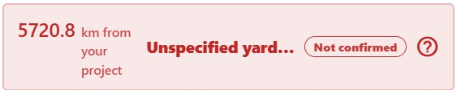
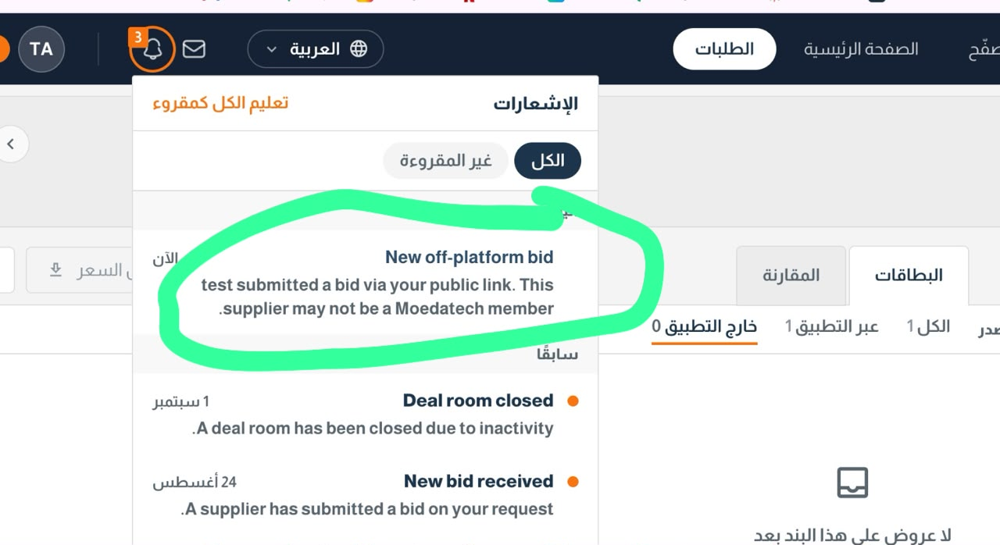

# To-do

**21 open · 0 done · last touched 2026-09-11**

Generated from `docs/todo.json` by the board. Do not edit this file: open the board instead,
`node scripts/todo-server.mjs`, and everything you tick, rank or type there lands here.

## Open

- [ ] P_ this is a major issue we have to change the UI for unspecific yards to just say unspecficied no lcoation and fix ui of map in general `web`
      notes:
      

- [ ] P_ Clicking on the bid doesn't take me directly where to the request `web`
      notes:
      

- [ ] P_ i logged in from fadwas laptop in another device and i was still connected + still managed to send from her email ( keep in mind ) test if it is sent from connection or from the registered email `web` `test`
      notes:

- [ ] P_ price on offline form doesnt support arabic and test if email exist in the form `web` `test`
      notes:

- [ ] P_ Preselected terms don't show up after no certificate and minimum year specifically from the project `web`
      notes:

- [ ] P1 outlook and request sharing seperation `app`
      notes:

- [ ] P_ fix ui in summary and review, copy link will open a note that it's generated later same with more and dominant the expiry cta `web`
      notes:

- [ ] P_ fix review and summary panel screenshot case `web`
      notes:

- [ ] P2 undefined and hidden taxonamy request `web`
      notes:

- [ ] P3 Check scenario of uploading multiple equipment with 1 offline and 1 online. Will system handle it smoothly on back end + will the email content sent show two different bid links ? If 5 different equipment 5 different bid links `web` `test`
      notes:

- [ ] P_ test direct request `web` `test`
      notes:

- [ ] P_ shaking operator and remove x from units `web`
      notes:

- [ ] P_ If possible let's make it so it shows the city in the location of site project `web`
      notes:

- [ ] P_ test closed requests and notifications in app `app` `test`
      notes:

- [ ] P_ test account 101 and check demo account `test`
      notes:

- [ ] P_ test taxonamy images `test`
      notes:

- [ ] P_ google verification `web`
      notes:

- [ ] P_ deep link md file `web`
      notes:

- [ ] P_ onboarding videos `web`
      notes:

- [ ] P_ using mansour design `web`
      notes:

- [ ] P_ compliance dashboard `web`
      notes:

## Done

_Nothing ticked off yet._
